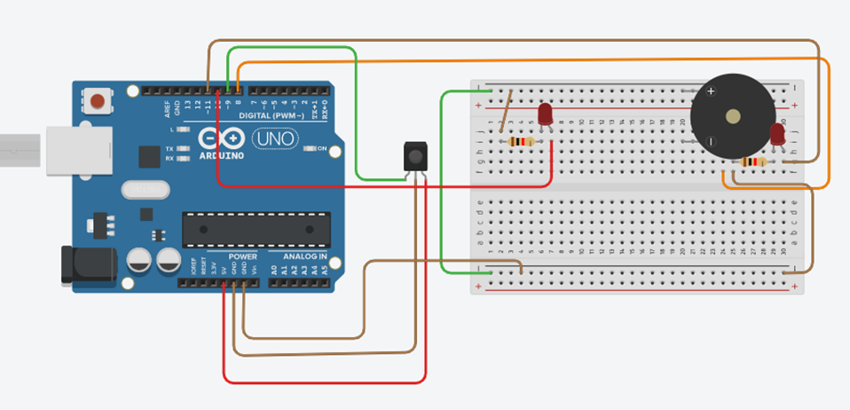

# Arduino Photo Finish

Program uses for running race

IR sensors can read the competitor

Program works for all arduino cards
```
  irdeg = digitalRead(irsens);
  zaman = (millis() / 1000) - 2;
  if (irdeg < 1) {
    digitalWrite(yLed, HIGH);
    yarismaci += 1;
    Serial.print(yarismaci);
    Serial.print(". yarışmacı tamamladığı sure : ");
    if(zaman > 60){
      Serial.print(zaman/60);
      Serial.print(" dk ");  
    }
    Serial.print(zaman % 60);
    Serial.println(" sn");
    delay(500);
    digitalWrite(yLed , LOW);
  } 
```
## Example Scheme


